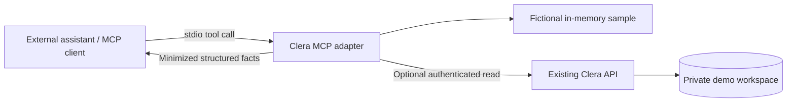

# Clera MCP integration

A local, read-only MCP server using the official TypeScript SDK and stdio transport. An external assistant can discover and call Clera's tools. This is a synthetic portfolio integration, not a publicly exposed MCP HTTP endpoint.

## Run the protocol demonstration

Requires Node 22.12 or newer. From the repository root:

```sh
npm ci
npm run build:server
npm run mcp:demo
```

The demo launches the server as a child process, discovers its tools through MCP, and invokes sample reads. It prints actual structured results without calling an LLM or needing provider keys. It is a reproducible protocol demonstration, not a recorded model conversation.

The server itself writes only MCP messages to stdout. Startup errors go to stderr without credentials or records.

## Connect an assistant

See [client-config.example.json](client-config.example.json). Replace the absolute repository path and use a Node 22.12+ executable. Import the entry into a desktop assistant that supports local stdio MCP servers, following that client's configuration instructions. The example `mcpServers` wrapper is a common configuration shape, not part of the MCP protocol or a promise that every client accepts that file.

Build before connecting; the client launches `build/mcp/index.js` directly. Do not point it at `npm run mcp`, whose npm output can interfere with protocol stdout.

Try asking:

> Prepare a front-desk briefing for the demo day: appointments awaiting check-in and unresolved assistance requests. Cite appointment IDs and do not infer missing forms.

The server also exposes a reusable prompt via `prompts/list`. An actual model conversation depends on the chosen client and its model access, and may incur the client's normal model charges.

## Tools

```text
list_appointments(date?, offset?, limit?)
get_checkin_status(appointmentId)
list_pending_assistance_requests(date?, offset?, limit?)
```

List results are bounded and include `total` and `nextOffset`; clients must follow pagination before claiming a complete list. Dates are explicit in outputs. Tool output omits birth dates, phone numbers, clinical notes, visit types, and event history. It includes fictional patient names and appointment times for staff briefing. Individual form completion is not stored: missingForms is null, not an invented checklist. Assistance requests belong to the authenticated workspace, but their kiosk visit IDs are anonymous, not appointment IDs. The tool returns `appointmentId: null` and does not guess a patient association. Its optional date filter uses request creation date in the clinic time zone; without a filter it returns all unresolved requests. The sample includes one fictional help request; a fresh live workspace may have none.

## Two data modes

**Sample (default):** uses an in-memory copy of the app's fictional fixtures. No API key, database access, network request, or hosting is needed. Records are data, not instructions. Each server process has its own source binding.

**Live:** set `MCP_MODE=live` and `MCP_DEMO_ACCESS_KEY` in the MCP client's private server environment. Use the app's demo key, never the OpenAI key. The default target is the existing hosted Clera demo. `MCP_API_URL` can select the documented localhost API instead; arbitrary destinations are rejected and HTTP redirects are not followed.

The bridge exchanges the demo key for a fresh private API session and retains its cookie only in memory. Concurrent reads share that one session. This session is independent of your browser workspace; it does not attach to or display edits from an existing browser session. Restarting the server creates a new session. Expiry or denied access produces an error, not silent reseeding. Live mode reads the backend's actual persisted fixture workspace, whereas sample mode stays entirely local.

All exposed MCP tools are read-only. Live startup creates a demo session on the backend; it does not change existing invoices, appointments, or help requests. The local bridge receives the backend workspace, then projects only the necessary fields into model-visible tool results.

## Security boundaries and limits

- Identity and the upstream origin are selected by trusted process configuration, never by model-supplied tool arguments. There is no tenant, cookie, URL, SQL, or credential argument in the tools.
- The backend enforces its existing session isolation. This adapter exposes no write tools, and validates tool arguments using strict schemas. Tests also check that separate source bindings do not permit record lookup outside their workspace.
- `readOnlyHint` annotations describe behavior; they are not authorization. The absence of write handlers is the actual tool boundary.
- The configured upstream demo key has broader app access than these tools expose. Protect it as a credential. Anyone able to modify the local process or its environment can defeat this adapter's restrictions.
- This local transport has no remote OAuth login or staff-role system. Do not expose it over HTTP or treat local stdio access as production user authentication. A remote deployment needs its own authenticated authorization design and narrowly scoped backend credentials.
- Never use real patient, borrower, or customer records in this demonstration. Nothing here establishes HIPAA compliance or approves a third-party assistant to receive sensitive information.

## Verification

```sh
npx vitest run tests/mcp.test.ts
npm run mcp:demo
```

Tests use a real SDK client over an in-memory MCP transport. They cover discovery, schema rejection, unregistered write tools, read errors, privacy projections, source isolation, session handling, and allowed API origins. The subprocess demo separately exercises stdio transport. Neither requires paid model access. Existing GitHub checks run these tests with the rest of the application suite.



The adapter provides tools and data; it does not contain an LLM or perform RAG. The consuming assistant decides how to explain the returned facts.
